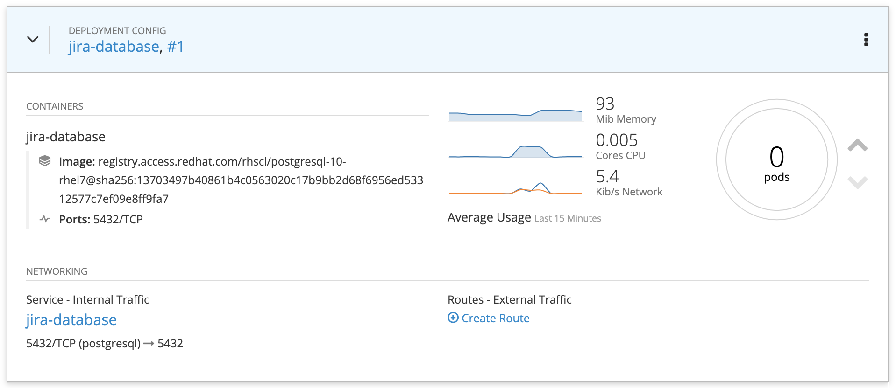
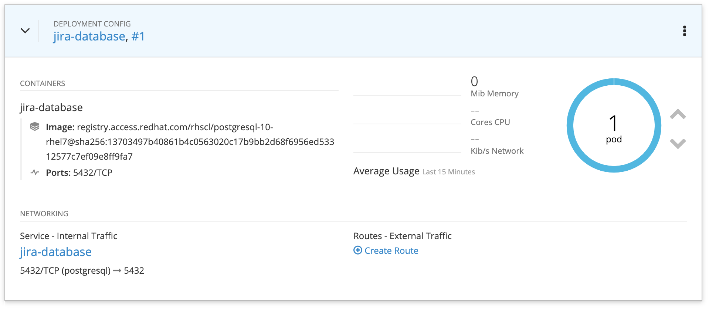
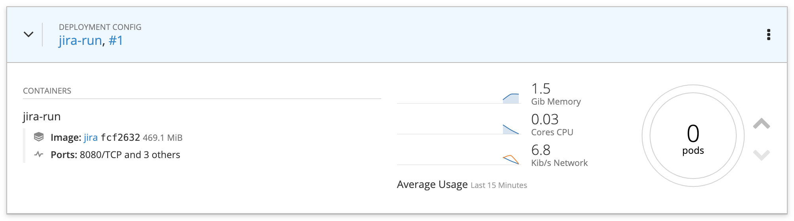
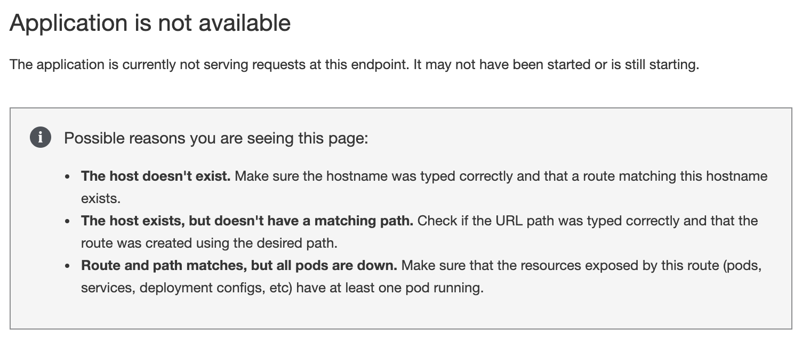
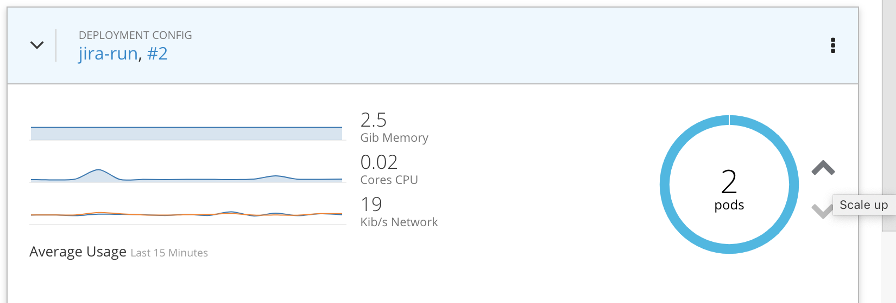
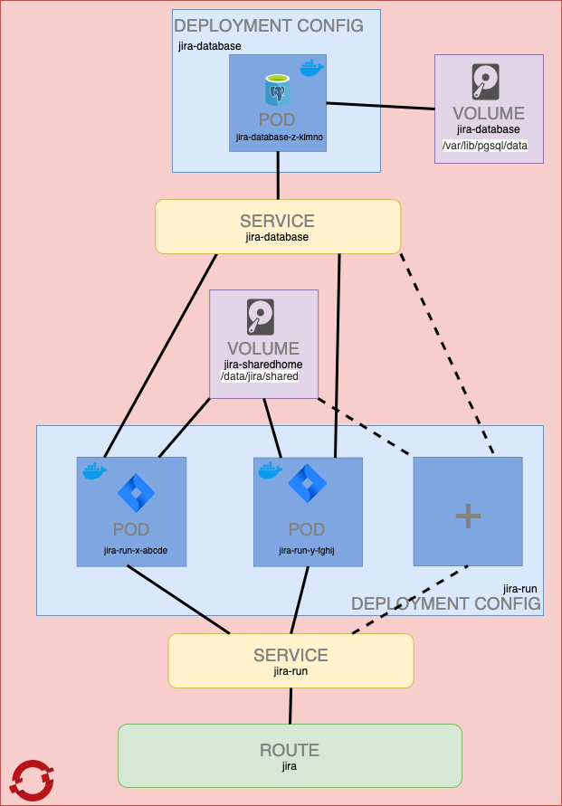

This repositoy contains all you need to deploy your own Jira Data Center instance on OpenShift/Kubernetes, in less than 5 minutes!

## Deploying Jira Data Center
Copy the raw content in [jira-postgresql.yaml](./jira-postgresql.yaml).

From the OpenShift console, click on **Add to Project > Import YAML / JSON**.

Paste the contents you copied at first step.

Click **Create**, then check **Process the template** and click **Continue**.

A setup wizard appears. You can change the preconfigured values if you wish, but it is not necessary: everything is preconfigured. Finish the creation by clicking on **Create**, then on **Close**. All necessary resources are now created in OpenShift.

In the **Overview** pannel, find the Deployment Config called **jira-database**, and click on the upper arrow to start the database.

Wait for it to be ready (takes a few minutes):

Still in the **Overview** pannel, find the Deployment Config called **jira-run**, and click on the upper arrow to start your first Jira node.

Wait for it to be ready (takes a few minutes):

Visit the Jira URL at the URL provided in the **Overview** pannel. 

If your are seeing the below message, then you need to wait a little bit more:

Otherwise, you will land on the setup page of Jira. Configure your licence, your admin user, and you will be good to go.

Happy planning with Jira!

## Adding nodes to the cluster
From the **Overview** pannel, find the **jira-run** Deployment Config, and scale it up:

## Tweaking the configuration
This template preconfigures Jira to work in Data Center mode with its dedicated PostgreSQL database, out of the box.

You will find all relevant configuration in the Config Maps embedded in the template [jira-postgresql.yaml](./jira-postgresql.yaml):
- `jira-environment` with the usual environment variables used by Jira
- `jira-clusterproperties` containing the **cluster.properties** file that gets injected in the system at start up
- `jira-dbconfigxml` containing the **dbconfig.xml** file that gets injected in the system at start up

To tweak the configuration, go to **Resources > Config Maps** in your OpenShift console, edit the Config Map, and re-deploy.

## My node restarted, and I don't see my issues anymore!
In Jira, click on the **Cogwheel icon > System > Indexing**, and perform a **Full re-index** of Jira.

## Kubernetes structure
